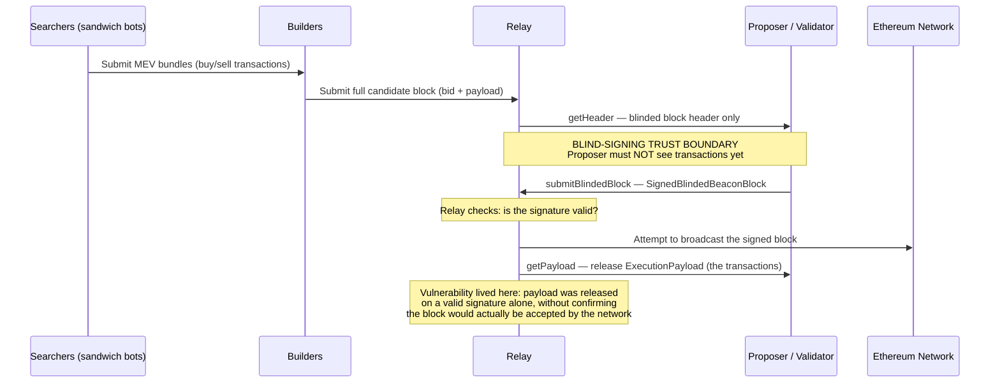

# The $25 Million Trust Boundary: A Technical Post-Mortem of the Peraire-Bueno MEV-Boost Exploit

*A case study in trust-boundary failure, Sybil positioning, and the limits of "code is law" — written for a security/pen testing audience, but readable without any crypto background.*

**Status note:** As of this writing (mid-2026), the Peraire-Bueno brothers have not been convicted of anything. Their first trial ended in a mistrial in November 2025. In March 2026 the brothers asked the court to dismiss the charges outright; the judge has said she won't set a new trial date until she rules on that motion, and that any retrial won't begin before November 2026. Everything describing their conduct below reflects allegations in the federal indictment, findings from independent security researchers, and reporting on the trial record — not proven facts. That's noted once here and should be assumed throughout.

---

## 1. The Short Version (No Crypto Background Required)

Skip this section if you already know what a blockchain, a wallet, and a "block" are. If you don't, here's the whole story in plain terms before we get technical:

Ethereum is a shared public ledger — imagine a giant spreadsheet that anyone in the world can read, and that no single company controls. Every 12 seconds or so, a new "page" (called a **block**) gets added, listing a batch of transactions. Someone has to decide what goes on that page and in what order, and — critically — *order matters*, because whoever controls the order can profit from it. There's an entire industry of automated bots built specifically to exploit that fact, all day, on Ethereum, usually at ordinary traders' expense — Section 2 explains exactly how.

Two brothers, both MIT graduates, allegedly figured out a way to beat those bots at their own game — not by hacking Ethereum itself, but by exploiting a flaw in separate helper software that most of those bots and block-builders rely on. That software makes a specific promise: "the person building the next page of the ledger won't be shown what's on it until it's too late to cheat." The brothers found a way to see the contents anyway, rearranged them in their own favor, and walked away with about $25 million worth of cryptocurrency in a single 12-second window. Nobody's account was hacked and no money was taken from a bank — the "victims" were the automated trading bots themselves, which is part of why this case is legally messy: is out-smarting a predatory bot itself a crime?

That's the whole story. Everything below explains exactly how, in more technical detail — but each technical term is explained the first time it shows up, so you shouldn't need outside research to follow along.

## 2. What Is MEV, and Why Does Anyone Care?

Every pending transaction on Ethereum sits briefly in a public waiting room called the **mempool** before it's added to a block. Anyone can look at that waiting room — including automated bots. If a bot spots a transaction that will move a price (say, a large purchase that will push a token's price up), it can react in real time: buy in ahead of it, let the price rise, then sell right after. This category of profit — extracted purely by controlling *when* and *in what order* transactions get processed — is called **MEV**, short for Maximal Extractable Value.

The specific technique the bots in this story used is a **sandwich attack**: place one transaction immediately before a victim's trade and one immediately after, "sandwiching" it, and pocket the price movement the victim's own trade caused. It's legal-but-widely-disliked in the Ethereum community, and it costs ordinary traders real money every day. Whether that's fair game or a form of exploitation is its own long-running debate — one this case ends up circling back to, since the "victims" in the story you're about to read were themselves running sandwich bots.

## 3. How Ethereum Blocks Actually Get Built

Since Ethereum's 2022 move to a system called proof-of-stake, a random computer on the network ("**validator**," also called the **proposer** when it's their turn) is chosen roughly every 12 seconds to propose the next block. Anyone can run a validator by locking up ("staking") a minimum amount of ETH as a kind of security deposit.

In theory, the proposer picks which pending transactions go into their block. In practice, almost none of them do this by hand. Instead, most run software called **MEV-Boost**, built around a model called **proposer-builder separation (PBS)**:

- **Searchers** (including sandwich bots) look for profitable transaction-ordering opportunities and submit bundles to **builders**.
- **Builders** are specialized services that assemble complete candidate blocks out of many searchers' bundles, competing to offer the most valuable block.
- A **relay** sits between builders and the current proposer. It shows the proposer only a block *header* — essentially a cryptographic commitment plus a promised fee — while withholding the actual list of transactions inside.
- The proposer signs a commitment to that header **before** seeing what's inside the block. Only after that signature is sent does the relay release the full transaction list.

This "blind signing" step is the entire security model, and it's worth sitting with why it exists: without it, a proposer could see a juicy, profitable bundle a searcher built, rip out the good parts for themselves, and either steal the opportunity or refuse to include the block at all. Blind signing is meant to make that structurally impossible — the proposer commits before they can see anything worth stealing.

Here's the same flow as a diagram, with the trust boundary marked explicitly — this is the exact seam the exploit in Section 5 lives in:

Here's the part that matters most for what comes next: **this promise is enforced by software convention, not by cryptography or the Ethereum protocol itself.** Nothing in Ethereum's actual rules requires a relay to behave this way — it's a design decision made by the teams that write relay software, and like any piece of software, it can have bugs.

## 4. The Setup

According to the indictment, the brothers began planning around December 2022, shortly after Ethereum's move to proof-of-stake made this kind of long-game positioning newly possible. Over several months they allegedly:

- Stood up **16 separate Ethereum validators** — 16 × 32 ETH, Ethereum's protocol-minimum deposit per validator, for exactly 512 ETH (roughly $880,000 at the time) — not for normal staking rewards, but to buy repeated chances at being picked as block proposer. The fact that the total lines up exactly with 16 validators at the protocol minimum, rather than some round dollar figure, is itself a tell: the capital was sized for a specific number of validators, not the other way around. The odds are worth stating plainly rather than hand-waving: Ethereum had somewhere around 500,000–600,000 active validators in early 2023, so any individual validator's shot at a given slot was about 1 in 560,000 — collectively, the brothers' 16 drew roughly a 1-in-35,000 chance per slot. But slots come every 12 seconds — 7,200 a day — and over the roughly four months they spent planning, that compounds into an expected couple dozen proposal opportunities, with a cumulative probability of getting picked at least once that rounds to effectively 100%. Any individual roll of the dice was a long shot; rolling it hundreds of thousands of times wasn't.
- Sent repeated **"bait" or "lure" transactions** — deliberately crafted to look like profitable arbitrage opportunities — to study how three specific sandwich-bot operators (the "victim traders" in the indictment) would react. This is behavioral fingerprinting: watching a predator's hunting pattern until you can predict it precisely.
- Identified three target bot operators whose bots reliably took the bait in a consistent, exploitable way.

None of this required breaking anything technical. It's reconnaissance and capital investment — buying your way into a privileged position within a system, then studying your target until their behavior is predictable. That pattern shows up constantly in real-world attacks on trust-based systems: a lot of the hardest work happens in positioning, long before any actual flaw gets triggered.

### 4.1 The Exploit Plan: A Four-Stage Playbook

One detail from the indictment is worth calling out specifically for a pentest audience: the brothers didn't improvise. Prosecutors allege they worked from a written "Exploit Plan" broken into four named stages, and executed each one in order:

1. **"The Bait"** — the lure transactions described above, designed to draw the target bots into a predictable trap.
2. **"Unblinding the Block"** — forcing the relay to leak the transaction payload early, using the malformed-block technique in Section 5.2.
3. **"The Search"** — going through the leaked payload to locate the specific victim transactions worth acting on.
4. **"The Propagation"** — assembling the replacement block and broadcasting it to the network as the final, accepted version.

If you've ever written a penetration test plan or a red-team rules-of-engagement document, this structure should look familiar: recon, initial access, target identification, and objective execution. The brothers approached a financial exploit with the same phased discipline a red-team operator would bring to a multi-stage campaign — which is part of why prosecutors leaned so heavily on premeditation to support intent, rather than resting the case on the technical mechanism alone.

## 5. The Exploit — Confirmed Mechanism

Early public explainers of the incident treated this mechanism as somewhat uncertain. It isn't — independent security researchers, including the well-known blockchain security researcher samczsun, dissected the technique in real time within hours of the theft on April 3, 2023, and Flashbots (the organization that maintains the open-source relay software involved) published its own postmortem confirming it.

### 5.1 The Honeypot: Weaponizing the Bots' Own Playbook

Section 2 covered what a sandwich attack is in general terms. The honeypot depended on the exact three-step mechanics of one, so it's worth breaking down precisely:

1. **Frontrun** — the bot buys an illiquid token using valuable stablecoins (e.g., USDC or USDT), right before the target's trade.
2. **Victim** — the target's transaction goes through, pushing the token's price up.
3. **Backrun** — the bot immediately sells the token back into the liquidity pool, pocketing the price difference in stablecoins.

The bots' entire profit depends on completing all three legs, especially the backrun — step 3 is where the money actually gets realized. The brothers' lure transactions were engineered to trigger exactly this playbook against a token they controlled. Once they had visibility into the full block (Section 5.2 below), they didn't need to touch the bots' frontrun leg at all — they let it execute normally, so the bots' real stablecoins flowed in to buy the token exactly as planned. What they removed was the backrun: the bots' sell-back transactions were dropped from the block entirely and replaced with the brothers' own transactions capturing that same value. The bots were left holding a pile of illiquid, near-worthless tokens they'd just paid millions of real dollars for, with no way to sell them back in that block. It's a honeypot in the truest sense — the trap wasn't sprung by tricking the bots into a bad decision, it was sprung by letting them make their *normal, correct* decision and then silently deleting the step that would have paid them for it.

### 5.2 The Relay Flaw, at the Protocol Level

The diagram in Section 3 shows the intended flow using the actual MEV-Boost API terminology: `getHeader`, a signed `SignedBlindedBeaconBlock` commitment, then `getPayload` releasing the real transactions only after the block is confirmed acceptable to the network.

The flaw sat exactly at that last step. The relay's validation logic checked that the **signature** on the `SignedBlindedBeaconBlock` was cryptographically valid, but it did not confirm the block itself — its parent hash, its state root, its actual consensus-level structure — was valid *before* releasing the payload. As long as the signature checked out, the relay treated the commit step as satisfied and handed over the transactions.

The brothers exploited exactly this gap. They submitted a block with a correctly signed header, but with the parent hash and state root both zeroed out — fields that make a block instantly and permanently rejected by the rest of the network, no matter what. Since the signature was valid, the relay released the `ExecutionPayload` anyway. The submitted block itself never went anywhere; it was dead on arrival by design. But the brothers weren't trying to get that block accepted — they were using it purely as a key to unlock the transaction data. They had the reveal without ever being bound to the commit.

With the real bundle contents in hand, they assembled a second, genuinely valid block — built the honeypot described in 5.1 into it — and that block, not the zeroed-out decoy, is what actually got signed for real, broadcast, and included on-chain. The entire sequence, from lure transaction to landed block, took about 12 seconds — the length of a single proposer slot.

### 5.3 The Fix

Flashbots and other relay operators patched the underlying `mev-boost-relay` codebase shortly after the incident. The core change: a relay will no longer release the `ExecutionPayload` just because a signature is valid. It now waits to confirm the signed block can actually be successfully published and accepted by the consensus layer — and several implementations added a short deliberate delay before responding, specifically to close off variations of this timing gap. In short, the fix moved the payload release from "the signature checks out" to "the block checks out and the network has accepted it."

Worth distinguishing this from *optimistic relaying* — a separate industry trend, already in development around the same period, where a relay skips full block simulation up front for speed and validates after the fact. It's sometimes framed as "the industry's response" to this incident, but that's not quite right: optimistic relaying trades away some of the same validation this exploit abused, and researchers have flagged it as reintroducing related risks (like block-equivocation races) rather than closing them. The actual fix was the stricter payload-release gating above; optimistic relaying is a different, ongoing tradeoff in the same architecture, not its resolution.

## 6. Vulnerability Classification

Framed the way a pentest report would frame it, this wasn't one bug — it was a chain of weaknesses stacked together:

| Weakness | Plain-English description |
|---|---|
| **Trust boundary enforced only at the application layer** | As covered in Section 3, this guarantee lives entirely in relay software, not in Ethereum's protocol or cryptography — so a bug in that software is enough to break it. |
| **Commit-reveal ordering violation** | The whole system depends on strictly "sign first, see contents second." Any bug that lets those two steps happen out of order — even through a weird edge case like a deliberately invalid submission — breaks the guarantee completely. |
| **Fail-open information disclosure** | The relay, faced with malformed input (the zeroed-out block), leaked data instead of cleanly rejecting the request. This is a classic pattern: software under unusual or bad input reveals more than it should, rather than less. |
| **Sybil-enabled positioning** | As Section 4's math shows, 16 validators turn a negligible per-slot chance into near-certainty over a few months — a resourcing and capital problem, not a coding bug. Proposer duties are also computable as soon as an epoch begins, so a well-positioned validator sees its slot coming, not just eventually gets one. The system assumed proposer selection would stay unpredictable in practice; that assumption breaks down against a patient, well-capitalized attacker. |
| **Business-logic dependency on incentives, not enforcement** | The whole proposer-builder-separation design assumes proposers will behave, because misbehaving is *supposed* to be against their financial interest. There's no hard technical backstop if that assumption fails. |

For anyone testing DeFi or blockchain-adjacent infrastructure: none of these look individually alarming. It's the combination — patient positioning plus a disclosure-ordering edge case — that turned into a $25 million outcome. That's a strong argument for taking business-logic and trust-model review as seriously as classic injection or memory-safety testing in this space.

### 6.1 Why a Standard CVSS Score Would Undersell This

It's worth pausing on how badly a traditional severity framework fits this bug, because it's illustrative of a broader problem in DeFi security triage. If you tried to score the relay flaw with CVSS v3.1, you'd land on something like:

- **Attack Vector:** Network (N)
- **Attack Complexity:** High (H) — required months of behavioral profiling and roughly $880,000 in staked capital just to guarantee a shot at exploiting it
- **Privileges Required:** Low (L) — nothing beyond standard, permissionless validator status
- **User Interaction:** None (N) — no victim has to click, approve, or act; it's purely attacker-vs-relay
- **Scope:** Changed (C) — a relay-layer bug that reached into control over final on-chain state
- **Confidentiality Impact:** High (H) — complete early disclosure of a private transaction payload
- **Integrity Impact:** High (H) — full attacker control over final block composition
- **Availability Impact:** None (N) — nothing is taken down or degraded; the bug leaks data, it doesn't disrupt service

That combination lands at 8.2 (High) — not wrong, exactly, but beside the point. CVSS was built for environments where impact means server compromise, data breach, or downtime; it has no native concept of a bug that, triggered once for twelve seconds, moved $25 million between parties never meant to interact. This is a pure economic-value-transfer bug, and frameworks built for traditional IT risk consistently struggle to price that correctly. Worth remembering when triaging DeFi or blockchain-adjacent findings: the CVSS number you produce may badly undersell — or in other cases overstate — what a business-logic flaw is actually worth to an attacker.

## 7. How They Got Caught

This is the part most coverage skips, and it's the most interesting part if you like the "how does an investigation actually unfold" angle.

**Hour zero — the internet notices immediately.** Because Ethereum is a fully public ledger, the theft was visible to anyone looking within minutes. Independent researchers on Crypto Twitter, including samczsun and Flashbots' own team, had the mechanism (the zeroed-out block trick) figured out and posted publicly the same day, April 3, 2023. A security firm tracked the stolen funds into three wallets almost immediately — roughly $19.9 million, $2.3 million, and $2.9 million — though none of that identified who controlled them; wallet addresses are more like anonymous account numbers than names. Every subsequent move of that money was watched in public, in real time, from that point forward.

Interestingly, the initial reaction from parts of the crypto community wasn't outrage — sandwich bots are widely disliked, and some on-chain researchers publicly joked that the attacker had done nothing wrong by turning the tables on them. That sentiment didn't survive contact with federal prosecutors.

**The freeze and the scramble.** According to the DOJ, foreign law enforcement managed to freeze roughly $3 million of the stolen funds early on, likely because that portion touched a cooperating centralized service. The brothers allegedly converted the remaining, unfrozen funds into DAI, a dollar-pegged stablecoin — probably to reduce volatility and ease movement — but this didn't make the funds untraceable; DAI transactions are just as public as any other Ethereum transfer. It only changed what the money looked like.

**The slow grind: attaching names to wallets.** This is the part that actually took time. Moving money on a public blockchain is instant and visible; figuring out *whose* identity sits behind a wallet address is the slow part, and it's usually where these cases live or die. The indictment describes shell companies, multiple private crypto addresses, and foreign exchanges used to obscure the trail — untangling it took **IRS Criminal Investigation (IRS-CI)**, the financial-crimes arm of the U.S. government that specializes in exactly this kind of money tracing (not the FBI), more than a year. These cases typically break at the fiat on/off-ramp: stolen crypto eventually has to touch a centralized exchange to become spendable dollars, and exchanges are required to collect identity information (**KYC**, "know your customer") on their users. A subpoena to the right exchange, tied to the right wallet cluster, is often what converts an anonymous address into a name on an arrest warrant.

**The self-inflicted wound.** One detail that reads straight out of a cybercrime-investigation story: prosecutors pointed to the brothers' own internet search history as evidence they understood what they'd done. The DOJ's own press release is fairly specific here — it states the brothers searched for information about how to carry out the exploit, ways to conceal their involvement, cryptocurrency exchanges with weak identity-verification (KYC) procedures they could use to launder the proceeds, attorneys with cryptocurrency expertise, extradition procedures, and the specific crimes they were later charged with. Court reporting from the trial adds a couple of more colorful specifics on top of that official summary — searches along the lines of "how to wash crypto," "top crypto lawyers," and a statute-of-limitations query (reported variously as relating to wire fraud or money laundering, depending on the outlet) — though the precise wording of those specific queries should be treated as secondhand rather than verbatim quotes from the indictment itself. (The defense argues the searches happened during privileged conversations with an attorney and shouldn't count as evidence of guilt; a judge has had to weigh in on whether jurors get to see them at all.) It's a familiar pattern in criminal investigations generally: the technical execution can be flawless, and the case still turns on ordinary, human, after-the-fact behavior — what someone searched for, who they talked to, how they tried to cover their tracks.

**The arrest.** Anton and James Peraire-Bueno were arrested on May 15, 2024 — Anton in Boston, James in New York — more than thirteen months after the exploit itself. That gap is itself the story: the theft took 12 seconds; figuring out who did it took over a year of financial forensics.

## 8. The Legal Question: Is This Fraud?

U.S. wire fraud requires a scheme to defraud someone using a material misrepresentation, typically involving some form of deception directed at the victim. The government's actual theory, made explicit at trial, is more specific than "they lied to a computer": prosecutors argued the brothers committed fraud by falsely holding themselves out as **"honest validators"** — that is, by participating in the network in a way that implicitly represented they'd play by the unwritten rules of the MEV ecosystem, when they had secretly planned to break them. The lure transactions and the manipulated signature, in this framing, were the mechanism of that false pretense.

The defense's counter is that nothing was ever "said" to the victims in any conventional sense — no message, no false statement to a human, no violated terms of service (there were none to violate). The bots operated entirely on public, on-chain data, and the brothers simply out-competed them using superior information about the system's own mechanics. Under that framing, this is a smarter trading strategy, not fraud — and "honest validation," as far as Ethereum's actual protocol is concerned, just means following the consensus rules encoded in the software, not some unwritten code of fair play.

That argument got real institutional backing during the first trial: in late October 2025, the crypto policy nonprofit **Coin Center** filed an amicus brief challenging the government's "honest validator" theory, arguing the concept is a technical/mathematical standard within Ethereum, not a legal or ethical one, and that the brothers hadn't broken any actual protocol rule. Prosecutors called the brief an improper attempt to invite jury nullification; the judge allowed it anyway. Whether "honest validator" survives as a viable fraud theory at all may be the single most consequential open question if the case ever reaches a second trial.

A closely related precedent sits right next door: in **United States v. Eisenberg** (Mango Markets, 2022), Avraham Eisenberg drained roughly $110 million from a DeFi platform by manipulating its own token's price to borrow against inflated collateral, calling it aggressive-but-legal trading. A jury convicted him in 2024, but in May 2025 a federal judge vacated the wire fraud conviction, ruling the government hadn't shown Eisenberg made a false representation to a self-executing smart contract that had no rules against his behavior. Prosecutors appealed that ruling in 2026, arguing it would unsettle the normal legal understanding of fraud. The Peraire-Bueno defense has leaned explicitly on this reasoning; the government counters that months of premeditation and the post-exploit search history are enough to show fraudulent intent, regardless of what a piece of software was or wasn't technically told.

The first jury deadlocked on this exact question in November 2025 after a three-week trial. What's notable is *what* they were stuck on — court reporting quoted a juror afterward saying the panel had little real disagreement about what the brothers actually did; the deadlock was entirely about how to interpret decades-old fraud law against a piece of autonomous software, including how to weigh the "good faith" defense available on wire fraud charges. Jurors described the deliberations as an emotional ordeal — reportedly citing tears and sleepless nights before finally telling the judge they couldn't reach a unanimous verdict. That's about as clean a real-world illustration as you'll find of the gap between "everyone agrees on the facts" and "no one agrees on what the facts mean under fraud statutes never written with autonomous, permissionless software in mind." The deadlock didn't resolve the case, and a second trial hasn't happened yet either: in March 2026, the brothers asked the court to dismiss the charges outright, leaning directly on the Eisenberg ruling discussed above. Judge Clarke has said she won't set a new trial date until she rules on that motion — and that if a retrial does happen, it won't begin before November 2026.

## 9. Takeaways for Practitioners

- **Test trust assumptions, not just inputs.** The core vulnerability here wasn't a parsing bug in isolation — it was a promise ("I won't show you the block before you commit") enforced entirely by software behavior. Any system making a similar promise — blind review processes, sealed-bid auctions, commit-reveal schemes, two-phase authorization flows — deserves explicit adversarial testing of the *ordering guarantee itself*, not just the individual endpoints.
- **Fail-open behavior under malformed input is a disclosure risk, not just a stability risk.** Fuzzing is usually framed around crashes and denial-of-service. This case is a reminder that malformed or edge-case input can also cause a service to leak data it was supposed to withhold — which is often more valuable to an attacker than a crash, and easier to miss in testing because nothing "breaks."
- **Positioning attacks are real threat models.** An attacker willing to spend months and real capital guaranteeing themselves a privileged position in a system (here: becoming a block proposer) is a legitimate adversary profile, especially anywhere "the reviewer/approver/proposer is random and therefore trustworthy" is an unstated assumption.
- **On-chain visibility isn't the same as identification.** The stolen funds were tracked publicly within hours; the people behind them weren't identified for over a year. If you're threat-modeling anything crypto-adjacent, remember that pseudonymity and anonymity are different things — the weak point is almost always the fiat on/off-ramp, not the blockchain itself.
- **Technical exploitation and legal liability are separate questions.** Something can be a genuine, well-executed exploit of a real software weakness and still land in a legal gray zone, especially in adversarial, unregulated environments without clear terms of service. That gap is exactly why writing clear findings — mechanism, impact, and context — matters as much as finding the bug in the first place.

## 10. Quick Glossary

- **Blockchain** — a shared, public record of transactions that anyone can read and no single company controls.
- **Block** — a batch of transactions added to that record roughly every 12 seconds on Ethereum.
- **Validator / Proposer** — a computer on the network responsible for proposing and confirming blocks; anyone can run one by staking ETH.
- **Wallet / address** — the equivalent of an account number on the blockchain; not inherently linked to a real-world identity.
- **Mempool** — the public "waiting room" of transactions that haven't been added to a block yet.
- **MEV (Maximal Extractable Value)** — profit made purely by controlling the timing or order of transactions in a block.
- **Sandwich attack** — placing one trade immediately before and one immediately after someone else's trade to profit from the price movement it causes.
- **Builder / Relay** — middleman software that assembles and hands off candidate blocks so proposers don't have to build them manually.
- **Blind signing** — a proposer committing to a block before being shown what's inside it, meant to prevent cherry-picking or theft.
- **Stablecoin (e.g., DAI)** — a cryptocurrency designed to hold a steady value (usually pegged to $1), unlike volatile coins like ETH.
- **KYC ("Know Your Customer")** — the identity-verification process centralized exchanges use, and usually the point where anonymous crypto activity gets tied to a real name.
- **Wire fraud** — the U.S. federal crime of using electronic communications as part of a scheme to defraud someone of money or property.

## 11. Sources

- U.S. Department of Justice, indictment and press release, *United States v. Anton Peraire-Bueno and James Peraire-Bueno*, No. 1:24-cr-00293 (S.D.N.Y., unsealed May 15, 2024)
- Flashbots Collective, "Post mortem: April 3rd, 2023 mev-boost relay incident and related timing issue"
- BlockSec, "Harvesting MEV Bots by Exploiting Vulnerabilities in Flashbots Relay"
- Halborn, "Explained: The MEV Bots Hack (April 2023)"
- Blockhead, "Exploiter Front Runs $25M From MEV Bots Using Ethereum Validator" (April 2023, including samczsun's real-time technical analysis)
- SolidityScan, "MEV Bot hack analysis — MEV Boost Relay Attack" (April 2023, relay validation logic and patch detail)
- Frontier Research, "Optimistic relays and where to find them" (April 2023, industry context on optimistic relaying)
- U.S. Department of Justice, press release (justice.gov/usao-sdny), primary source for the search-history and IRS-CI investigation detail
- Blockworks, "DOJ charges 2 brothers tied to $25M attack on MEV bots last year" (May 2024, "Exploit Plan" four-stage detail)
- Coin Center, "Amicus Brief in Support of Peraire-Bueno's Objections to 'Honest Validator' Theory of Fraud" (October 2025)
- Business Insider, "Mistrial declared for MIT brothers accused of $25M crypto heist. Deadlocked jury complained of tears, sleepless nights." (November 2025)
- CoinDesk, "Brothers Accused of $25M Ethereum Exploit as U.S. Reveals Fraud Charges" (May 2024)
- CNBC, "Feds charge brothers in $25 million cryptocurrency heist that took 12 seconds" (May 2024)
- Insurance Journal / AP, "MIT Grad Brothers Fraud Jury Unable to Reach a Verdict" (November 2025)
- DL News, "Court dispatch: MEV bros point to Eisenberg acquittal in high-stakes hearing" (March 2026)
- DL News, "Prosecutors appeal acquittal of Mango Markets exploiter Avraham Eisenberg" (April 2026)
- TRM Labs, "Federal Judge Overturns All Criminal Convictions in Mango Markets Case Against Avraham Eisenberg" (May 2025)
- Gibson Dunn, "2025 SDNY Trends and Takeaways" (January 2026)

*Author's note: this piece synthesizes public reporting, independent security research, and court filings for educational purposes. It is not based on a formal disclosure from Flashbots or the relay operator beyond their public postmortem, and some fine-grained details (exact transaction counts, precise relay code paths) vary slightly between sources.*
